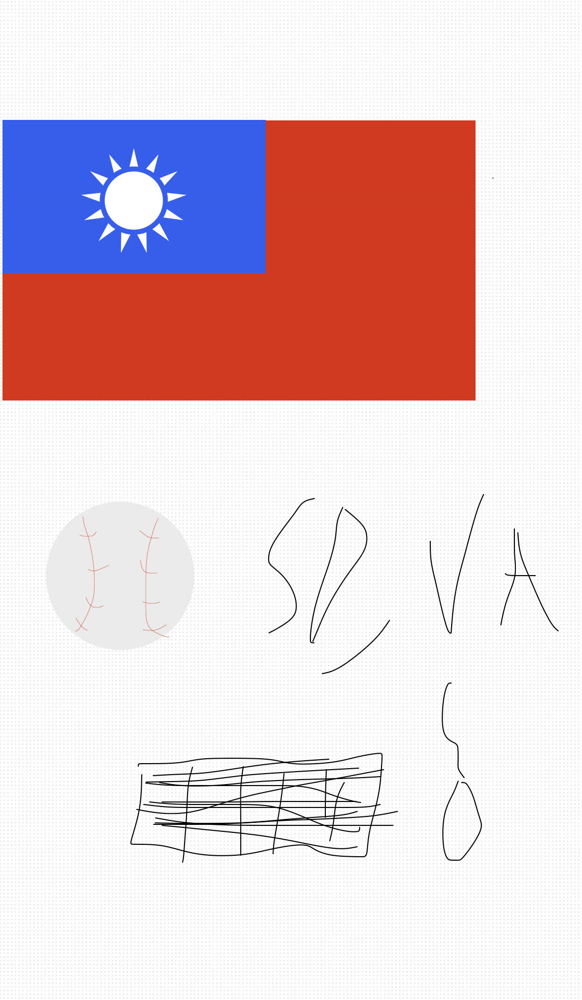

## Ethan Hong

## Short Biography
I'm Ethan Hong, I like playing baseball and videogames, I was born and raised in California while the rest of my family excluding my mother lives in Virginia. We are Taiwanese and enjoy variaties of food. DNHS Class of 2025

## Schedule
<table border="1">
    <tr>
        <th>Period</th>
        <th>Header 2</th>
    </tr>
    <tr>
        <td> 1</td>
        <td>US History 1</td>
    </tr>
    <tr>
        <td> 3</td>
        <td>AP Calc AB</td>
    </tr>
    <tr>
        <td> 5</td>
        <td>AP Physics Mechanics</td>
    </tr>
    <tr>
        <td> 7</td>
        <td>AP CSP</td>
    </tr>
    <tr>
        <td> 5</td>
        <td>American Lit</td>
    </tr>
</table>

- Plans, Lists, [Scrum Boards](https://clickup.com/blog/scrum-board/) help you to track key events, show progress and record time.  Effort is a big part of your class grade.  Show plans and time spent!
- [Hacks(Todo)](https://levelup.gitconnected.com/six-ultimate-daily-hacks-for-every-programmer-60f5f10feae) enable you to stay in focus with key requirements of the class.  Each Hack will produce Tangibles.
- Tangibles or [Tangible Artifacts](https://en.wikipedia.org/wiki/Artifact_(software_development)) are things you accumulate as a learner and coder. 
